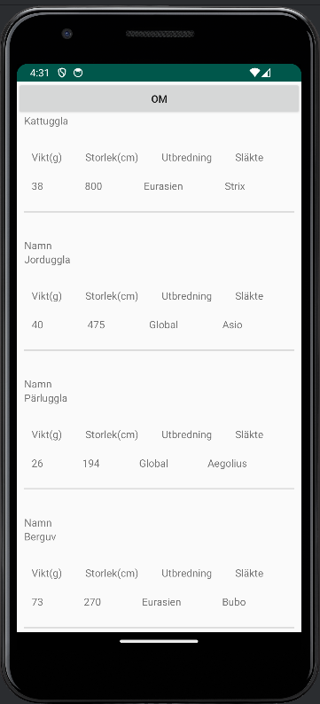
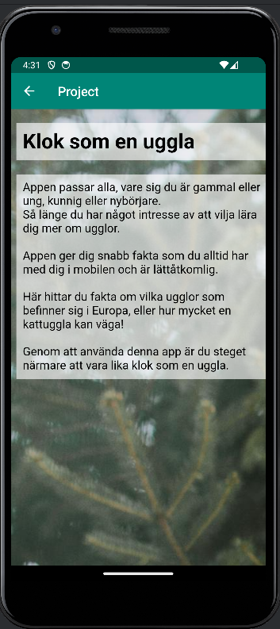

# Rapport

Det första som gjordes med projektet var att lägga till data i en API som sedan skulle hämtas med hjälp av JSON och GSON.
Datan skulle visas i en recycler view och denna byggdes upp med linearlayout och textviews.
För att kunna hämta rätt data till rätt textview skapades en klass där alla kategorier som användes i API:n skapdes och efter det skapades getters och setters samt constructor för att kunna hämta datan till recycler view.
För linearlayouten användes både horisontell och vertikal layout för att kunna skapa den layout som önskades.
En andra aktivitet lades till för att kunna använda en Webview som visade en "om appen" sida. "Om" sidan som skapades var en HTML fil som lades till i webview.
För att ta sig till den andra aktiviteten lades en knapp till som placerades högst upp på första aktiviteten. Denna har en onclick listener som öppnar den andra aktiviteten när den blir tryckt på. 


Koden nedan visar hur datan med fakta om ugglor kopplas till den textview de ska ha. Ifrån owl klassen som skapades med getters och setters samt constructor, 
kan data hämtas med hjälp av "get___()". För att sätta rätt data till rätt textview, har alla textviews ett id, detta id:t används
längst ner i koden där den skapar nya variabler för de existerande textviews som sedan används för recycler view adaptern. 
Dessa varibaler används för att sedan kunna hämta en kategori och sedan lägga till den datan i den passande viewn.
Tex. Namn hämtas med hjälp av getName() och denna data kopplas ihop med textview "nameView". "nameView" har hämtat sin textview från
den textview med id:t "name" (I MyViewHolder) och då hamnar namnet på ugglorna i den textview. 
```
 @Override
    public void onBindViewHolder(@NonNull recyclerviewadapter.MyViewHolder holder, int position) {
        holder.nameView.setText(owls.get(position).getName());
        holder.sizeView.setText(owls.get(position).getSize());
        holder.costView.setText(owls.get(position).getCost());
        holder.locationView.setText(owls.get(position).getLocation());
        holder.categoryView.setText(owls.get(position).getCategory());
    }

    @Override
    public int getItemCount() {
        return owls.size();
    }

    public static class MyViewHolder extends RecyclerView.ViewHolder{
        TextView nameView;
        TextView sizeView;
        TextView costView;
        TextView locationView;
        TextView categoryView;

        public MyViewHolder(@NonNull View itemView) {
            super(itemView);

            nameView = itemView.findViewById(R.id.name);
            sizeView = itemView.findViewById(R.id.size);
            costView= itemView.findViewById(R.id.cost);
            locationView = itemView.findViewById(R.id.location);
            categoryView = itemView.findViewById(R.id.category);
```

### Screenshots



